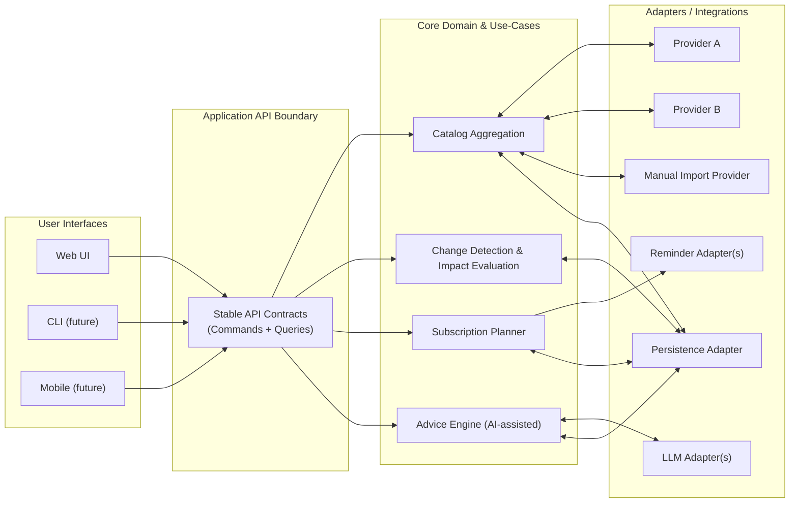

# PSMA Architecture Overview (Tech-Agnostic)

## Goals

- UI-agnostic: support multiple UIs (web now; others later) without rewriting core logic.
- Provider-agnostic: ingest show/availability data from multiple sources, reconcile conflicts, and retain provenance.
- Deterministic planning: generate subscription instructions using testable rules and explicit assumptions.
- AI-assisted guidance: produce user-specific recommendations/questions when data or preferences change; confirmation-based.
- Local-first viability: run standalone with minimal/no ongoing costs.
- Future-aware security: designed for later secure login and multi-user isolation.

## Non-goals (MVP constraints)

- Full coverage of every streaming service is not guaranteed in MVP.
- Automated subscribe/unsubscribe is out of scope for MVP.
- AI is advisory; it does not become the authoritative source of truth.

## System decomposition

PSMA uses a “core + ports/adapters” approach.

- **Core** (business logic, tech-agnostic)
  - Domain model (shows, services, availability windows, user preferences)
  - Use cases (sync catalog, manage selections, generate plan, evaluate changes)
  - Engines (deterministic business logic)
    - Availability Engine (canonical availability assessments from heterogeneous facts)
    - Planner (subscribe/unsubscribe plan generation)
    - Advice Engine (AI-assisted, confirmation-based explanations/questions)

- **Adapters** (replaceable)
  - Provider adapters (catalog + availability)
  - LLM adapters (OpenAI-compatible, local models, etc.)
  - Reminder adapters (calendar export, email, notifications)
  - Persistence adapters (local DB, etc.)
  - UI adapters (web UI, CLI, mobile, etc.)

## Component diagram

## Key architectural principles

1. **Stable boundaries**: providers and UIs integrate through contracts, not by calling internals.
2. **Provenance everywhere**: every external fact is tagged with source, timestamp, confidence.
3. **Explicit assumptions**: planning uses documented rules (billing/proration buffers, etc.).
4. **Human confirmation**: AI suggests changes; user confirms.
5. **Event-driven thinking**: updates produce events; events trigger evaluation, suggestions, and plan deltas.

## Engines (critical business logic)

PSMA implements critical business logic as **engines**: deterministic modules that consume canonical facts and emit canonical outputs.

Engine constraints:
- Engines are vendor-agnostic; adapters translate external APIs into canonical fact types.
- Engine outputs are contract-first and should be validated against JSON Schemas (e.g., availability assessments).
- Engines must remain deterministic given the same inputs; any user tie-breaks must be stored as explicit, provenance-backed facts/preferences.

See also:
- [docs/technical/18-Availability-Engine.md](18-Availability-Engine.md)
- [docs/technical/17-Availability-Semantics-and-Subscribe-Planning.md](17-Availability-Semantics-and-Subscribe-Planning.md)
