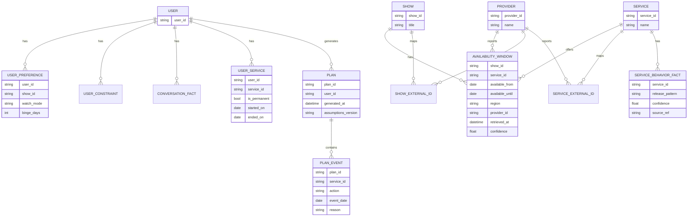

# Domain Model (Conceptual)

This is a conceptual model. Implementation details (tables, collections, etc.) are intentionally omitted.

## Core concepts

- **Show**: a program the user can select (optionally includes seasons/episodes).
- **Service**: a streaming provider (e.g., Netflix, Hulu).
- **Availability Window**: when a show (or season) is available on a service in a region.
- **User Preference**: how the user wants to watch a show.
- **User Service Profile**: services the user already has (including “permanent” always-on services).
- **Plan**: a set of subscribe/unsubscribe events with rationale.
- **Provenance**: metadata describing where a fact came from and how trustworthy it is.

Note on terminology:
- In JSON contracts (engine/provider outputs), the upstream adapter identifier is called `source_id`.
- In the conceptual ER diagram below, the same concept is represented as `provider_id` on `PROVIDER` and referenced by facts.

## Availability representation

PSMA standardizes provider data into **availability windows**:

- A window has a start date.
- The end date may be known, unknown, or “currently available” (depending on provider fidelity).
- Windows may overlap across services or conflict across sources.

## Planner inputs

- Selected shows
- Per-show preferences (watch mode, binge duration, constraints)
- User service profile (existing subscriptions; permanent services)
- Availability windows (merged view)
- Service behavior knowledge base (SBKB) facts (e.g., release patterns)
- Explicit planning assumptions (buffer days, billing-cycle simplifications)

## Planner outputs

- A time-ordered list of **plan events**:
  - subscribe to service X on date D
  - unsubscribe from service X on date D
- Each event has a **reason** (which shows/preferences drove it).

## Conceptual ER diagram

## Notes on future-proofing

- All user-related records are user-scoped from day 1.
- External IDs are first-class to support multi-provider merging.
- Provenance is stored with every imported fact.
