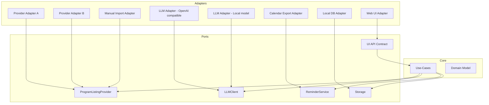

# Ports & Adapters (Tech-Agnostic)

This document describes the stable contracts (“ports”) and the replaceable implementations (“adapters”).

## Why ports/adapters

- Enables multiple providers without changing core logic.
- Enables multiple UIs without changing core logic.
- Enables experimenting with LLM vendors (including OpenRouter) via configuration.

## Primary ports

### Program listing provider

Responsibilities:
- Provide show metadata (title, identifiers).
- Provide availability windows for a region (US) and a point in time.
- Optionally refresh/research release dates.

Provider outputs must include provenance:
- provider id
- retrieval time
- confidence
- optional source reference

### LLM client

Responsibilities:
- Produce structured advice (recommendations, questions, explanations) given:
  - user profile + conversation facts
  - plan snapshot + plan delta
  - availability changes/conflicts
  - SBKB facts

Notes:
- LLM is advisory; outputs are confirmation-based.
- Adapter should be configurable (provider, base URL, model, API key).

### Reminder service

Responsibilities:
- Turn plan events into user reminders.
- MVP can be calendar export (ICS) and/or in-app reminders.

### Persistence

Responsibilities:
- Store catalog snapshots + provenance.
- Store user selections/preferences.
- Store plan snapshots.
- Store AI suggestions/questions and user confirmations.

### UI boundary

Responsibilities:
- Present catalog, selections, plan, and suggestions.
- Capture user confirmations.

Key constraint:
- UI is a client of stable API contracts; it should not contain core planning logic.

## Adapter composition

## Provider merge policy (conceptual)

- Inputs: facts from multiple providers.
- Outputs: a merged “canonical view” + a set of conflicts.
- Policy is deterministic and configurable:
  - prefer more recent facts
  - prefer higher-confidence providers
  - preserve conflicts for user review

AI can assist by summarizing conflicts and recommending resolutions, but does not silently override sources.
