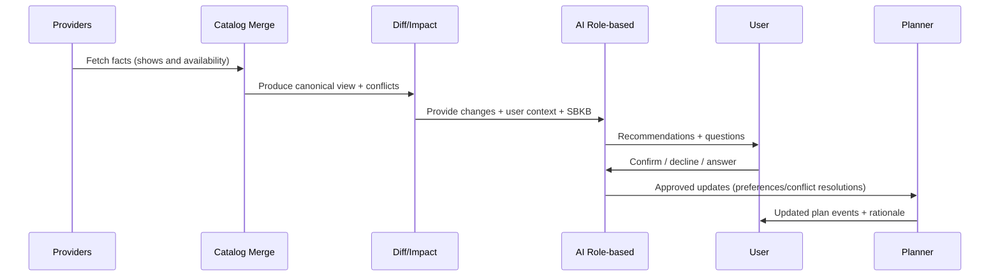

# AI / Agent System (Tech-Agnostic)

## Purpose

The AI layer provides user-specific guidance and questions when:
- catalog data changes
- provider conflicts are detected
- the user’s preferences imply suboptimal decisions given known service behaviors

The AI layer is **advisory**:
- it recommends
- it explains
- it asks questions
- the user confirms changes

## Key design: roles (“agent bios”)

PSMA supports multiple agent roles. Each role is defined as an `AgentProfile`.

### AgentProfile (conceptual)

- `id` (e.g., `scheduler`, `researcher`)
- `bio` (system instruction / role definition)
- `allowed_outputs` (must be structured)
- `allowed_actions` (MVP: suggest only)
- `tools_allowed` (what internal data and actions it may access)

The agent system chooses a profile based on the use case.

## Example roles

### Scheduler agent

Primary outcome:
- Suggest preference or plan changes that better match user goals.

Typical triggers:
- A plan delta increases subscription overlap.
- A user preference conflicts with known service behavior.

Example (release-pattern guidance):
- If a service typically drops full seasons at once, and the user chose “watch as episodes release,” the scheduler suggests bingeing.

### Researcher agent

Primary outcome:
- Help resolve unknowns and conflicts, with provenance.

Typical triggers:
- Two providers disagree about availability.
- A release date is unknown and the system needs user input or follow-up.

## Service Behavior Knowledge Base (SBKB)

SBKB contains curated facts about services that improve advice quality.

Conceptual schema:
- `service_id`
- `release_pattern`: all_at_once | weekly | mixed | unknown
- `confidence`
- `source_ref`
- `notes`

SBKB is a fact store; AI uses SBKB rather than relying on “model memory” of service behaviors.

## AI outputs must be structured

To keep UIs stable and reduce vendor/model drift, AI outputs should be a structured object.

Conceptual output:
- `recommendations[]`
  - type: preference_change | plan_change | question
  - summary
  - details
  - confidence
  - based_on: [facts]
- `questions[]`
  - prompt
  - answer_options (optional)
  - why_needed
- `explanation`

## AI guardrails

- AI cannot invent availability facts.
- Any statement about data must cite provenance (provider + retrieval time).
- Any preference change must be user-confirmed.
- Store:
  - what was suggested
  - why
  - what the user decided

## AI workflow (overview)

## LLM provider configurability

- LLM integration is behind an adapter.
- Runtime-configurable fields typically include:
  - provider (e.g., OpenAI-compatible)
  - base URL (e.g., OpenRouter endpoint)
  - model identifier
  - API key

This allows developers to experiment with different models without changing the core.
