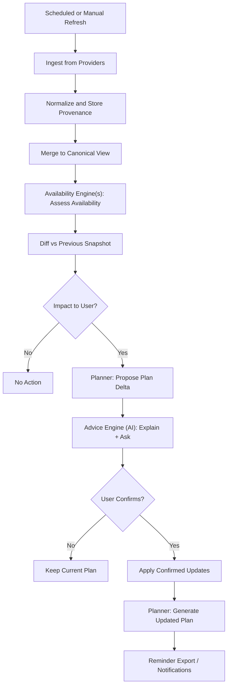

# Data Flow & Events (Tech-Agnostic)

## Motivation

Streaming data changes regularly. PSMA treats updates as a normal part of operation.

The architecture is built around:
- refresh (ingest)
- diff (detect changes)
- impact evaluation (what matters for a user)
- plan delta (what would change)
- confirmation (user decides)

## Event types (conceptual)

- `CatalogRefreshed`
- `AvailabilityChanged`
- `ReleaseDateChanged`
- `ProviderConflictDetected`
- `UserPreferenceChanged`
- `PlanGenerated`
- `PlanDeltaProposed`
- `UserConfirmedChange`

## Refresh and plan lifecycle

Notes:
- “Availability Engine(s)” are responsible for turning heterogeneous facts (snapshots, schedules, lineups) into canonical availability assessments.
- The planner consumes those assessments plus user preferences/service profile and produces deterministic plan events.

## Conflicts as first-class objects

When providers disagree, PSMA records a conflict rather than hiding it.

- conflict types:
  - show identity match uncertainty
  - availability window disagreement
  - service mapping disagreement

Conflicts can be:
- auto-resolved using deterministic policy (safe cases)
- suggested by AI and user-confirmed (common case)

## Plan delta concept

A plan delta summarizes what would change if the plan is regenerated:
- subscriptions added/removed
- subscribe/unsubscribe dates moved earlier/later
- concurrent subscription count changes

The delta is what makes the “confirm changes” UX clear and low-friction.
