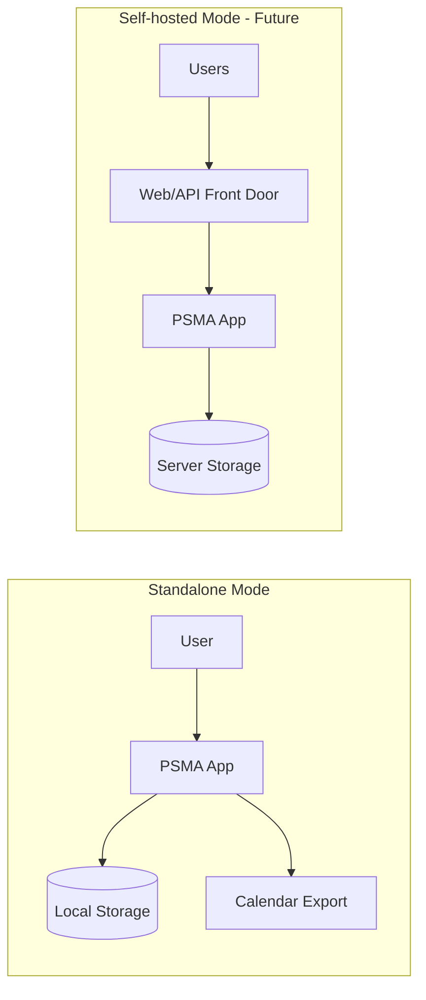

# Security & Identity (Future-Aware, Tech-Agnostic)

## MVP posture

MVP is intended for internal pilot use and may run standalone.

However, the architecture should be future-aware of:
- secure login
- multi-user data isolation
- auditability for AI suggestions

## User scoping from day 1

Even if MVP runs as “single user,” the system should treat user identity as an explicit concept:
- every selection, preference, plan, and conversation fact is associated with a user

This makes adding login later a migration, not a redesign.

## Authentication/authorization boundary

Auth should be implemented as a boundary around the API contract:
- MVP: no auth or a simple local mode
- Later: pluggable auth (OIDC, SSO, etc.)

The core planner and domain logic should not depend on a specific auth mechanism.

## Data handling

- Store minimal necessary data.
- Store provenance for imported facts.
- Store audit trails for:
  - AI suggestions
  - user confirmations/declines
  - conflict resolutions

## AI safety and trust

- AI outputs are advisory.
- Changes require confirmation.
- Every recommendation should be explainable:
  - “why”
  - “based on what sources”
  - “confidence”

## Deployment options (conceptual)

## Secrets management

- Keep LLM/provider keys out of source control.
- Use environment variables or a secrets store appropriate to the deployment.

## Compliance note

This document describes architecture only. Any production deployment should include a threat model and privacy review.
