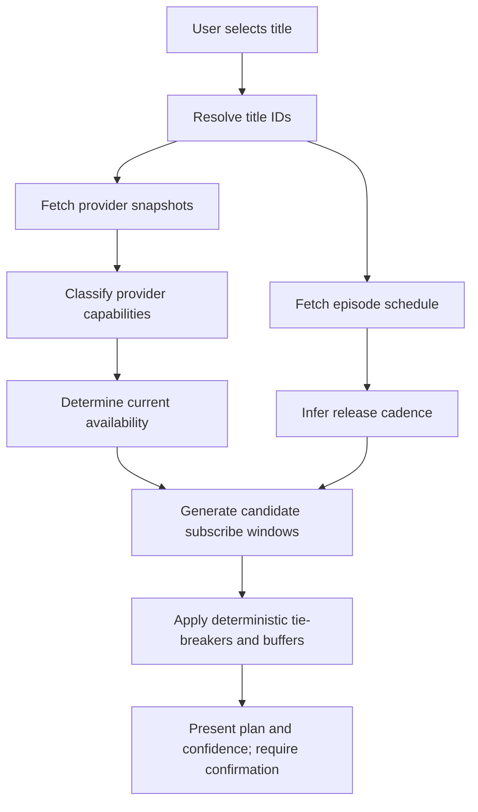

# Availability Semantics and Subscribe/Unsubscribe Planning

This document defines PSMA’s business logic for interpreting provider data and episode schedules, and how those inputs roll up into subscribe/unsubscribe recommendations.

Scope:
- How PSMA should decide whether a title is **currently available** on a service (best-effort).
- How PSMA should treat different **types of services** (on-demand libraries vs live bundles).
- How PSMA should use **episode cadence** to pick subscription windows.

Non-goals:
- Guaranteeing ground-truth availability (provider catalogs change; data sources are best-effort).
- Implementing UI specifics.

## Key Concepts

### Title
A show/series the user wants to watch. Titles may have different IDs per provider (TMDB ID, TVmaze ID, etc.).

### Provider / Service
A consumer-facing service where content can be watched (e.g., Netflix). Some providers behave like **on-demand libraries**; others are **live TV bundles/aggregators**.

### Availability Snapshot
A point-in-time claim that a title is offered via a provider in a region.

- Snapshots are retrieved from a source at `retrieved_at`.
- Snapshots can become stale without any “end date” signal.

See also:
- ADR-0003-Unknown-Availability-End-Date-Policy.md

### Episode Air Schedule
Episode air timestamps (past and future) from a scheduling source (e.g., TVmaze).

Important: air schedule is not, by itself, an “on-demand availability” signal.

### Monetization Type
A label describing how the title is offered via the provider (examples: subscription/flat-rate, free-with-ads, rent, buy).

## Data Sources (Current)

### TMDB “Watch Providers” (JustWatch-sourced)
What it is:
- A best-effort mapping from title → provider(s) by country.

What it answers well:
- “Is this title currently offered by this provider in this country?” (best-effort)

What it does *not* answer reliably:
- Future availability end date.
- Which seasons/episodes are included.
- Live vs DVR vs on-demand nuances for live bundles.

Notes:
- The provider catalog and title mappings may be incomplete (e.g., YouTube TV may not be present, or may not be mapped for a title).

### TVmaze Episodes
What it is:
- A schedule / episode list with timestamps.

What it answers well:
- “When did episodes air?” / “When are the next episodes expected?”

What it does *not* answer reliably:
- “Is the title available on-demand on Provider X right now?”

## Provider Capability Model (Business Requirement)

PSMA needs a capability model because not all providers support the same watching behaviors.

### Provider Categories (Minimum Useful Set)

1) **On-demand library (SVOD/AVOD)**
- Examples: Netflix, Hulu (core), Max, Peacock (varies), etc.
- Interpretation:
  - If a title is listed for the provider via watch-providers data, treat it as **available on-demand now** (best-effort).

2) **Transactional (TVOD)**
- Examples: rent/buy listings.
- Interpretation:
  - Availability may be stable, but costs vary; planning may be different than subscription windows.

3) **Live TV bundle / aggregator**
- Examples: YouTube TV, Sling, Fubo, DirecTV Stream.
- Interpretation:
  - “Title is on the service” is ambiguous and depends on:
    - live airings on carried networks
    - DVR capability
    - catch-up VOD windows
  - Watch-provider data may be incomplete for these services.
  - Accurate planning requires additional schedule/EPG or network-level availability data.

### Why This Model Matters

- Titles with **no upcoming air dates** can still be fully available on-demand (e.g., complete seasons on Netflix).
- Titles with upcoming air dates might only be available via live airing + DVR, not as a full back-catalog.

## Determining “Currently Available” (Best-Effort)

PSMA’s default interpretation should be:

- A title is **currently available** on Provider P in Country C if:
  - the latest availability snapshot includes Provider P for the title in Country C, and
  - the snapshot is within an acceptable staleness horizon.

Staleness policy:
- If snapshots are old (beyond the horizon), PSMA should downgrade confidence and/or prompt for refresh.
- The exact horizon belongs in refresh policy and should align with ADR-0003.

### Confidence Levels (Suggested)

- **High**: Snapshot retrieved recently; provider category is on-demand library.
- **Medium**: Snapshot retrieved recently; provider category is transactional.
- **Low**: Snapshot retrieved recently; provider category is live bundle OR provider catalog is known incomplete.
- **Unknown**: No snapshot for the provider/title/country.

## Planning Subscribe/Unsubscribe Windows

Planning depends on both (a) provider type and (b) episode cadence.

### Inputs
- User-selected title(s)
- User region (country)
- User service profile (including permanent services)
- Candidate providers and their categories
- Availability snapshots for title/provider/country (best-effort)
- Episode air schedule (past + upcoming)
- User preferences (buffers, “binge vs weekly”, etc.)

Implementation note:
- The current API supports an extensible `inputs[]` request field and `questions[]` response field so the planner can ask for missing personalization data while remaining deterministic.
- See `docs/technical/20-Planner-Inputs-and-Questions.md`.

See also:
- ADR-0004-Deterministic-TieBreakers-and-Buffers.md

### Core Heuristics (MVP)

1) **On-demand library**
- If title is currently available:
  - If the user is binge-watching: subscribe “as late as possible” (when starting), unsubscribe shortly after completion (with buffer).
  - If new episodes are upcoming weekly: subscribe near the first desired episode air date; unsubscribe after the last desired episode + buffer.

2) **Transactional**
- Do not generate subscription windows.
- Present cost/availability as a purchase decision (outside this document’s scope).

3) **Live bundle / aggregator**
- If used at all in planning, treat as “schedule-driven”:
  - subscribe before the relevant airing window
  - unsubscribe after the window + buffer
- Without a dedicated EPG/network schedule source, mark recommendations as low-confidence.

### How Episode Data Is Used

Episode schedule informs *timing*, not basic availability:
- **Upcoming episodes** indicate when a new season is in progress.
- **Past episodes only** indicates either:
  - the show has ended, or
  - the schedule source doesn’t provide future dates for the series.

In both cases, on-demand availability must come from provider snapshots.

## Processing Flow

## Permanent Services (User Profile)

Some users keep certain services always enabled (e.g., a live TV bundle as a permanent cord-cutting service).

Business rules:
- Permanent services are treated as already subscribed for the plan horizon.
- The planner must not generate subscribe/unsubscribe events for permanent services.
- The planner may still recommend add-on subscriptions to complement permanent services.

## Known Gaps / Follow-ups

- Provider catalog completeness varies; some providers may be missing entirely from snapshots.
- Title-level provider mappings may not specify which seasons are included.
- Live bundles require EPG/catch-up policy data to produce high-confidence schedules.

## Practical Implications for the Current Smoke Tester

- Episode lists should be labeled as **air dates/times**.
- “Currently available” should be derived from provider snapshots, not episode timestamps.
- UI should reflect confidence and `retrieved_at` for snapshot freshness.
