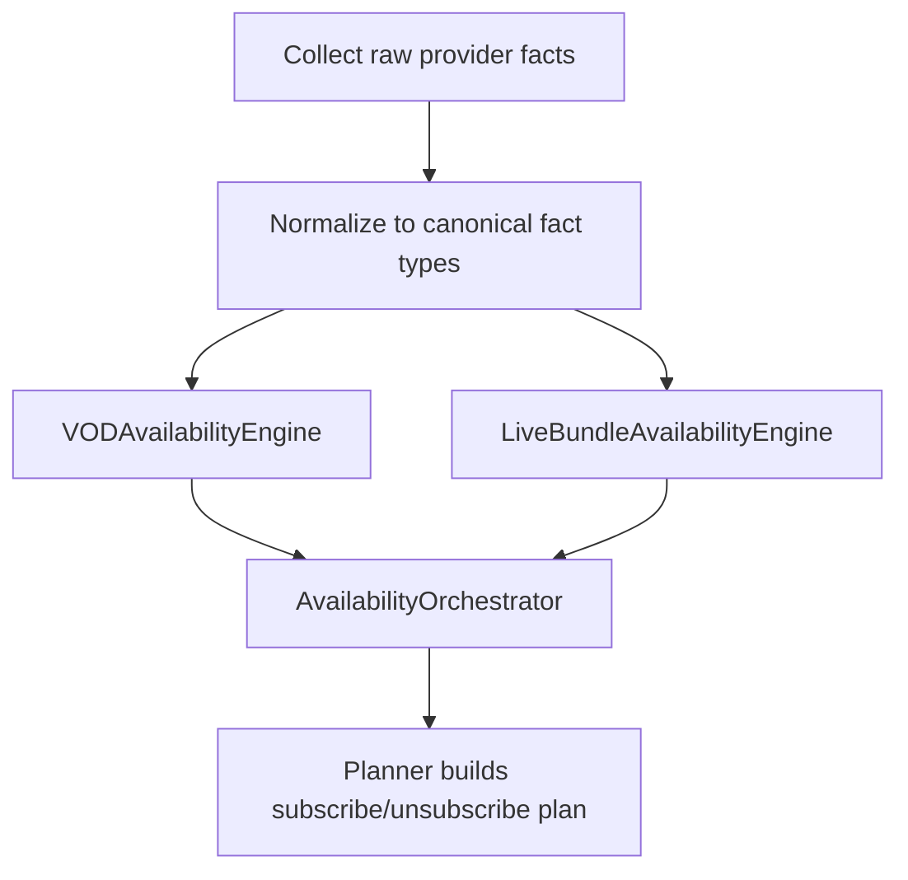

# Availability Engine (Design)

This document specifies the **Availability Engine** as a core PSMA capability.

Goal:
- Accept **N heterogeneous inputs** from multiple APIs/providers (availability, metadata, schedules, lineups).
- Produce deterministic, explainable outputs suitable for planning subscribe/unsubscribe actions.

Design constraint:
- Adding a new service/provider must be possible by implementing a new adapter that emits canonical facts, without changing core engine logic.

Non-goals:
- Perfect or guaranteed ground truth.
- A single monolithic “do everything” engine.

## Why an Engine

The system needs an engine because the signals are different:
- Episode air dates/times explain *cadence*.
- Watch-provider snapshots explain *“available now”* (best-effort).
- Live bundles require network/EPG semantics, not only title-level provider mappings.

The engine is a **core module** behind stable ports/adapters (not UI code).

## Architecture Overview

PSMA should treat availability as two related but distinct problems:

1) **On-demand availability (Title → Provider)**
- Primarily driven by provider snapshots (e.g., TMDB/JustWatch data).
- Enhanced by metadata resolution and season/episode context when available.

2) **Live bundle availability (Title → Network → Bundle)**
- Driven by network lineups + EPG/airings + DVR/catch-up rules.
- Title-level “watch providers” data may be missing or misleading for bundles.

This suggests two engines with a small orchestrator:
- `VODAvailabilityEngine`
- `LiveBundleAvailabilityEngine`
- `AvailabilityOrchestrator` merges results into a unified view.

## Contracts (Inputs)

All inputs follow PSMA’s provider-fact rule: provenance + retrieval time + confidence.

Extensibility rule:
- New external APIs must be integrated by mapping their outputs into the existing canonical fact types (or by introducing a new canonical fact type + schema versioning), not by embedding vendor-specific branching inside the engines.

### Common Envelope
Every input record should carry:
- `source_id`
- `retrieved_at`
- `confidence` (source or computed)
- optional `source_ref`

### Input Types (Minimum Set)

1) **Title identity facts**
- Mappings between IDs: TMDB ID, TVmaze ID, etc.

2) **Title-level provider snapshots**
- For a given title and country, a set of provider offerings (and monetization types).

3) **Episode schedule facts**
- Past and upcoming air times.

4) **Provider capability facts** (registry)
- Provider category (SVOD/AVOD/TVOD/live bundle)
- Optional properties (DVR supported, catch-up window typical, etc.)

5) **User service profile facts**
- Which services the user already has.
- Which services are marked **permanent** (always-on) for planning purposes.

### Live Bundle Input Types (Future/Phase 2)

6) **Network lineup facts**
- For each bundle provider, which networks/channels are included by region.

7) **EPG / airing facts**
- Title or series airings on a network over a time range.

8) **DVR / catch-up policy facts**
- Whether recordings persist, typical expiration, replay windows.

### Future: Premium inputs (paid tier)

Premium APIs can improve accuracy by providing any of:
- Explicit availability windows (start/end) instead of “available now” snapshots.
- Richer season/episode coverage per provider.
- Network lineup + EPG/airings at scale for live bundles.

Design constraints:
- Premium inputs must remain optional adapters behind the same canonical fact types.
- The orchestrator/planner must degrade gracefully when premium inputs are absent.

## Contracts (Outputs)

The engine should produce outputs that are:
- **deterministic**
- **explainable** (reasons + evidence)
- **confidence-scored**

Compatibility rule:
- Adding a new provider must not require changes to the output contract. If a contract change is unavoidable, it must be versioned and validated via schema/contract tests.

### Availability Assessment (per provider)
Suggested fields:
- `title_id` (canonical)
- `country`
- `service_id` (canonical)
- `provider_category` (svod|avod|tvod|live_bundle|unknown)
- `availability_now` (`"true"`|`"false"`|`"unknown"`)
- `availability_window` (optional: start/end when known)
- `confidence` (high|medium|low)
- `reason_codes[]`
- `evidence[]` (references to input facts)

Canonical contract:
- [contracts/jsonschema/availability/availability-assessment.v1.schema.json](../../contracts/jsonschema/availability/availability-assessment.v1.schema.json)

### Planning Hints
The engine can optionally produce planning-friendly signals:
- `cadence` (weekly|batch|ended|unknown)
- `next_air_time` (optional)
- `last_air_time` (optional)

Note: these are *inputs* to the planner; the planner still applies ADR-0004 tie-breakers and buffers.

## Decision Logic (High Level)

### VODAvailabilityEngine
- Primary rule: provider snapshot indicates offering in country → `availability_now = true` (best-effort).
- Apply staleness policy (ADR-0003) to adjust confidence.
- Use provider capability registry to interpret ambiguous providers.
- If the provider is marked permanent in the user profile, the planner should treat access as already satisfied (no subscribe/unsubscribe events for that provider).

### LiveBundleAvailabilityEngine
- Primary rule: bundle includes network AND EPG shows relevant airings in the user’s horizon.
- Output is windowed (subscribe before airings; unsubscribe after last airing + buffer).
- Without EPG/lineup data, output should remain low-confidence or unknown.
- If the live bundle is marked permanent, the engine can still emit availability assessments so the planner can prefer it (no subscription events required).

## Processing Flow

## Practical Next Steps (Docs-Only)

Completed:

1) Stable JSON schema for `AvailabilityAssessment` output:
  - [contracts/jsonschema/availability/availability-assessment.v1.schema.json](../../contracts/jsonschema/availability/availability-assessment.v1.schema.json)
  - [contracts/jsonschema/availability/availability-assessments-response.v1.schema.json](../../contracts/jsonschema/availability/availability-assessments-response.v1.schema.json)
2) Initial curated service registry (canonical `service_id` + category + external IDs):
  - [contracts/registry/service-registry.v1.json](../../contracts/registry/service-registry.v1.json)

Still needed:

3) Identify candidate EPG/lineup sources for live bundles (even if not implemented yet).

4) Define adapter registration and configuration:
- enable/disable providers via config
- per-provider credentials and rate limits
- country/region coverage metadata

Related:
- 17-Availability-Semantics-and-Subscribe-Planning.md
- 12-Provider-Data-Plan.md
- ADR-0003-Unknown-Availability-End-Date-Policy.md
- ADR-0004-Deterministic-TieBreakers-and-Buffers.md
